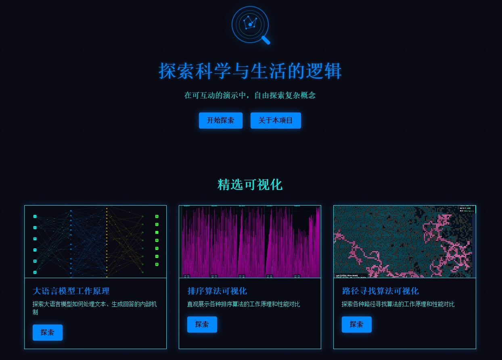

# LogicLens (逻辑透镜)

<div align="center">
  
  <h3>在可互动的演示中，自由探索复杂概念</h3>
</div>

## 项目简介

LogicLens（逻辑透镜）是一个致力于通过可交互的可视化演示，将复杂的科学和生活逻辑以深入浅出的方式呈现给大众的项目。通过结合现代Web技术和科幻风格的UI设计，我们创建了一系列交互式可视化工具，帮助用户理解各种复杂概念。

## 核心目标

- **打破知识壁垒**：让复杂概念变得易于理解
- **激发学习兴趣**：通过视觉化的方式提高学习体验
- **科学与艺术结合**：展示科学与艺术的完美融合
- **结合AI提升学习效率**：利用人工智能技术增强学习体验

## 已实现的可视化

### 算法与计算
- **大语言模型工作原理**：交互式探索LLM的内部机制
- **路径寻找算法可视化**：包括A*、Dijkstra和真菌生长算法等
- **旅行商问题算法可视化**：探索TSP问题的不同解决方案

## 技术栈

- **前端框架**：Vue3

## 本地开发

### 安装依赖
```bash
npm install
```

### 启动服务器
```bash
npm run dev
```

## 项目结构

```
LogicLens/
├── public/               # 静态资源
│   ├── images/           # 图片资源
│   └── *-visualization.html  # 独立可视化HTML文件
├── src/
│   ├── components/       # Vue组件
│   ├── views/            # 页面视图
│   ├── store/            # 状态管理
│   ├── router/           # 路由配置
│   ├── assets/           # 资源文件
│   ├── App.vue           # 主应用组件
│   └── main.js           # 应用入口
└── README.md             # 项目说明
```

## 贡献指南

我们欢迎各种形式的贡献，无论您是科学爱好者、学生、教育工作者，还是对世界运作原理充满好奇的人，都可以参与到LogicLens的开发中来。

1. Fork本仓库
2. 创建您的特性分支
3. 提交您的更改
4. 推送到分支
5. 开启一个Pull Request

## 许可证

本项目采用MIT许可证 - 详情请参见 [LICENSE](LICENSE) 文件

## 联系方式

GitHub Issues: [https://github.com/AlanLee1996/LogicLens/issues](https://github.com/AlanLee1996/LogicLens/issues)

---

<div align="center">
  <p>无论您是科学爱好者、学生、教育工作者，还是对世界运作原理充满好奇的人，LogicLens都能为您提供一个全新的视角，探索各种现象背后的逻辑。</p>
</div>
